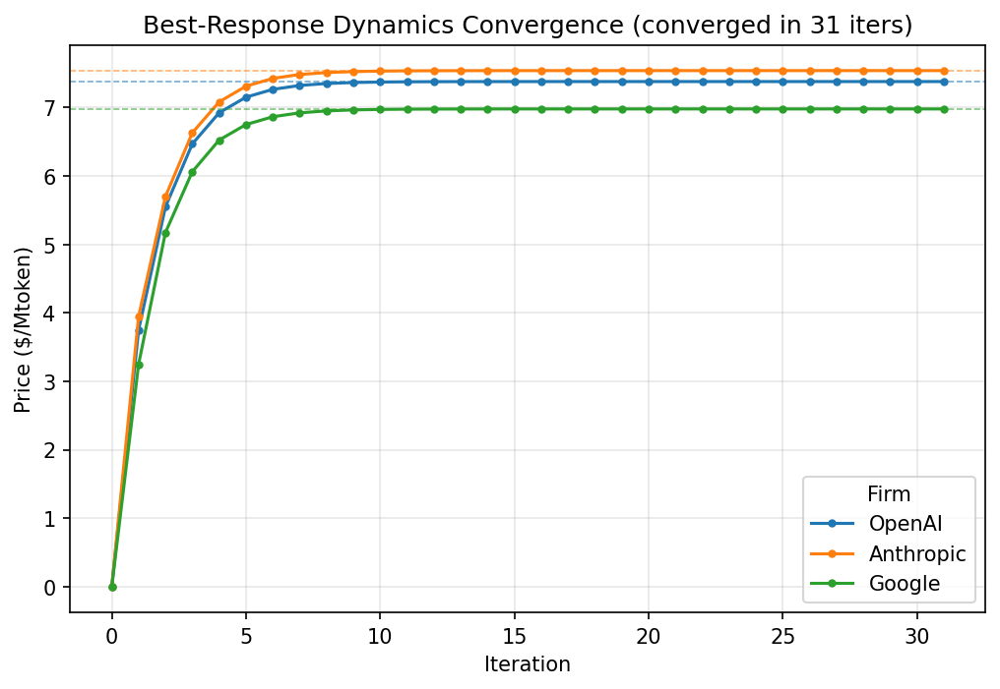
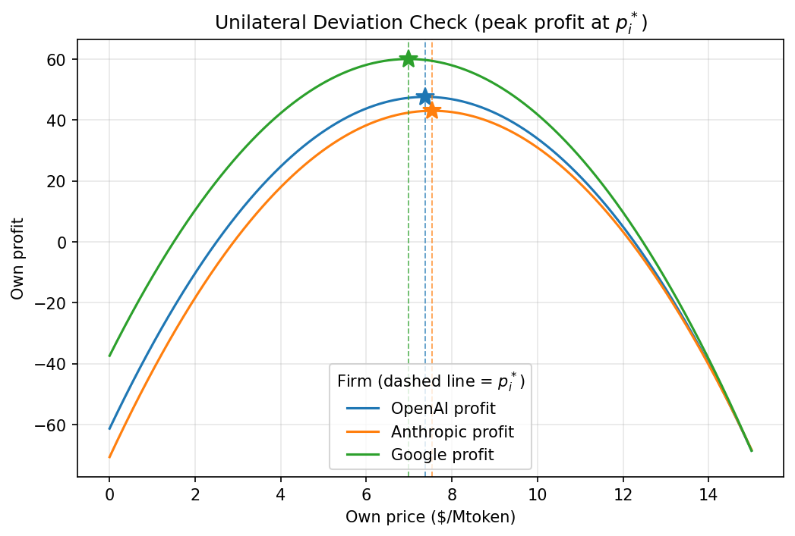
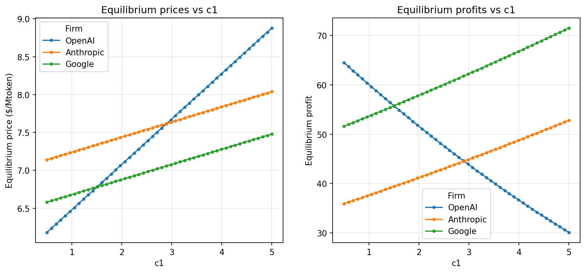
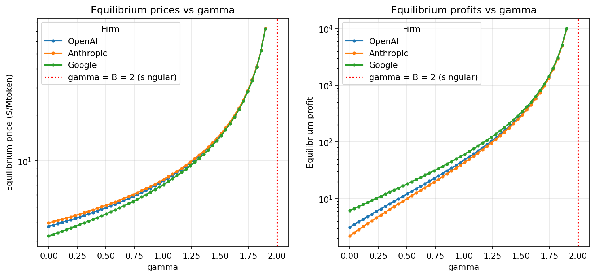

# 仿真结果记录

> 本文件记录四块仿真的运行结果与图表分析。数值由 `uv run python scripts/*.py`
> 与 `uv run pytest` 复现，参数口径见 `src/bertrand_game/config.py`。
> 文中图片由 `scripts/*.py` 生成（运行时写入 `outputs/`），并以快照形式存于
> `docs/images/` 供文档引用；如需刷新，重跑脚本后把 `outputs/` 下对应图片
> 复制到 `docs/images/` 即可。

## 1. 纳什均衡（解析解）

构造 `M·p = b`（对角 2B=4、非对角 −γ=−1；`b = A + B·c = [15, 15.8, 13]`），
`np.linalg.solve` 求解后回代需求 / 利润函数。

| | OpenAI (1) | Anthropic (2) | Google (3) |
|---|---|---|---|
| 均衡价 p\* | 7.38 | 7.54 | 6.98 |
| 均衡需求 Q\* | 9.76 | 9.28 | 10.96 |
| 均衡利润 π\* | 47.6288 | 43.0592 | 60.0608 |

与建模组期望值（`EXPECTED_*`）逐项吻合（利润四舍五入即 47.63 / 43.06 / 60.06，
测试容差 atol=1e-2 通过）。

**经济规律**：成本 c₂>c₁>c₃ ⟹ 价格 p₂\*>p₁\*>p₃\*；Google 成本最低 ⟹ 需求最大、
利润最高。

## 2. 最优反应动态收敛

同步（Jacobi 式）迭代，每轮三家按上一轮对手价做最优反应，收敛判据为相邻两轮
价格差范数 < tol。

| 初始价格 | 是否收敛 | 迭代轮数 | 终值 | 与 p\* 距离 |
|---|---|---|---|---|
| (0, 0, 0) | 是 | 31 | (7.38, 7.54, 6.98) | 5.9e-09 |
| (20, 1, 15) | 是 | 30 | (7.38, 7.54, 6.98) | 7.6e-09 |

从任意初值均收敛到同一 p\*，**均衡是稳定吸引子**。理论上迭代矩阵谱半径为
γ/B = 0.5 < 1，保证全局收敛。

图：价格收敛曲线（横轴迭代轮次，纵轴价格，水平虚线为各家均衡价 p\*）。

## 3. 单边偏离检验

固定其余两家于均衡价，在 [0, 15] 上对每家扫 2001 个价格点算其利润。

| 厂商 | 数值最优价 | 理论 p\* | 峰值利润 |
|---|---|---|---|
| OpenAI | 7.380 | 7.380 | 47.629 |
| Anthropic | 7.537 | 7.540 | 43.059 |
| Google | 6.982 | 6.980 | 60.061 |

利润峰值均落在各自 p\*（偏差在网格步长 0.0075 量级），**任何单边偏离都使利润下降**，
数值验证 p\* 为纳什均衡。

图：三家利润-价格曲线（竖直虚线为各家均衡价 p\*，星标为数值最优点，均落在 p\* 上）。

## 4. 比较静态分析

### 4.1 成本 cᵢ 扫描（结论与预期一致）

固定其余参数，扫描 OpenAI 边际成本 c₁ ∈ [0.5, 5.0]，逐点重解均衡。

| c₁ | p₁\* | π₁\* |
|---|---|---|
| 0.50 | 6.180 | 64.525 |
| 1.62 | 6.855 | 54.706 |
| 2.75 | 7.530 | 45.697 |
| 3.88 | 8.205 | 37.498 |
| 5.00 | 8.880 | 30.109 |

**结论**：自身成本上升 ⟹ 自身均衡价单调上升、均衡利润单调下降。符合预期。

图：均衡价格 / 利润随 OpenAI 边际成本 c1 的变化（左：价格，右：利润）。

### 4.2 差异化系数 γ 扫描（与第2版报告的概念澄清一致，构成数值佐证）

扫描 γ ∈ [0, 1.95]（其余参数不变），逐点重解均衡：

| γ | p₁\* | p₂\* | p₃\* | 总利润 Σπ\* |
|---|---|---|---|---|
| 0.00 | 3.75 | 3.95 | 3.25 | 11.46 |
| 0.30 | 4.39 | 4.57 | 3.92 | 24.45 |
| 0.60 | 5.30 | 5.48 | 4.87 | 51.62 |
| 0.90 | 6.72 | 6.88 | 6.31 | 113.55 |
| 1.05 | 7.76 | 7.92 | 7.37 | 174.70 |
| 1.35 | 11.31 | 11.46 | 10.93 | 479.37 |
| 1.65 | 20.93 | 21.07 | 20.57 | 2067.07 |
| 1.95 | 146.07 | 146.20 | 145.73 | 123899.06 |

**实测趋势**：γ 越大，均衡价与利润**同向单调上升**，并在 γ→B=2 处发散；
γ 越小，价格与利润越低。

**与第2版报告概念澄清一致**：第2版报告新增「模块4 概念澄清」，明确 γ 是
**价格联动 / 替代品关联系数**而非竞争强度，γ↑ 代表厂商**定价协同性增强**而非
竞争加剧；并声明本文只分析差异化 Bertrand，**不涉及趋于同质的零利润悖论极限**。
据此，本节实测结果正是该澄清的**数值佐证**：γ↑ 推高价格与利润、γ→B 奇异发散，
与"协同性增强"的定性预期完全吻合。

**机理**：本需求形式 `Qᵢ = A − B·pᵢ + γ(pⱼ+pₖ)` 中，对手提价对自身需求的提振项
`γ(pⱼ+pₖ)` **没有上界**，因此 γ 在模型里扮演**价格协同**的角色——γ 越大，三家越能
"借对手高价共同抬价"，而非加剧竞争。数学上系数矩阵 `M = (2B+γ)I − γJ`，
行列式 `det(M) = (2B−2γ)(2B+γ)²`，在 **γ=B 处奇异**，故 γ→B 时价格发散；这也
解释了为何分析需对 γ 取上界留余量（γ<B），符合报告"不涉及同质极限"的界定。

图：均衡价格 / 利润随差异化系数 γ 的变化（纵轴为对数刻度，红色虚线标注 γ=B 奇异线）。

## 5. 结论

- 解析解、反应动态、单边偏离三块互相印证 p\* ≈ (7.38, 7.54, 6.98) 为唯一稳定
  纳什均衡，成本结构决定了价格 / 利润排序。
- 成本比较静态符合直觉。
- **γ 比较静态为第2版报告的概念澄清提供数值佐证**（详见 4.2）：γ 是价格协同
  系数，γ↑ → 价格 / 利润同向上升、γ→B 奇异发散，体现定价协同性增强而非竞争
  加剧；分析限定在差异化 Bertrand（γ<B），不涉及趋于同质的零利润悖论极限。
